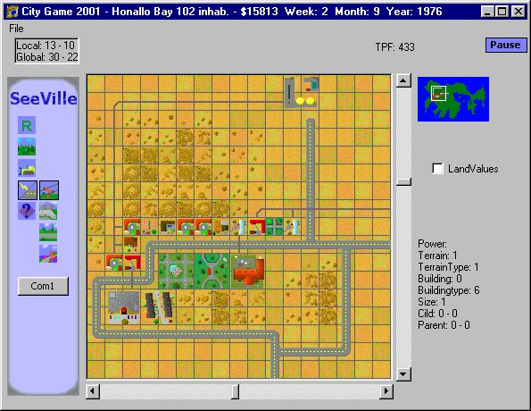

<div align="center">

## See Ville


</div>

### Description

See Ville is a city simulator, much like Sim City (The good o'll one). to put it short;

- It's Bigish

- It's Bugish

- It's Messy

- and it's FAAAAR form complete <g>

Far, far, far from done... Only residental buildings are compelted, and MANY importaint functions are still missing (some because I can't figure out how to do it). Eventhough, I thought I would share it with the VB comunity, and get som feedback :)

P.S. If anybody have a good idea on how to distribuate the citizens over all the res. buildings, get i touch with me, please, it's hard! ;)
 
### More Info
 
I had to remove all the bmps to upload it, sorry


<span>             |<span>
---                |---
**Submitted On**   |2001-07-22 22:45:58
**By**             |[Jonas Ask](https://github.com/Planet-Source-Code/PSCIndex/blob/master/ByAuthor/jonas-ask.md)
**Level**          |Intermediate
**User Rating**    |4.4 (40 globes from 9 users)
**Compatibility**  |VB 6\.0
**Category**       |[Games](https://github.com/Planet-Source-Code/PSCIndex/blob/master/ByCategory/games__1-38.md)
**World**          |[Visual Basic](https://github.com/Planet-Source-Code/PSCIndex/blob/master/ByWorld/visual-basic.md)
**Archive File**   |[See Ville232607222001\.zip](https://github.com/Planet-Source-Code/jonas-ask-see-ville__1-25326/archive/master.zip)

### API Declarations

```
Function BitBlt Lib "gdi32"
Function GetTickCount Lib "kernel32.dll"
```


